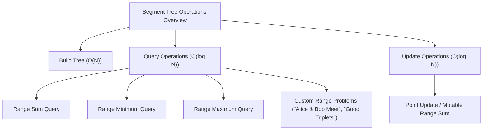

# 🚀 LeetCode Solutions: Segment Tree Mastery

## Short Description
Dive deep into the world of efficient data manipulation with this comprehensive collection of Segment Tree implementations. This repository showcases optimized C++ solutions for a variety of common and complex problems, ranging from fundamental range queries (sum, minimum, maximum) to intricate scenarios like finding meeting points or counting specific array permutations. Perfect for competitive programmers, data structure enthusiasts, and those preparing for technical interviews, this project provides clear, performant examples of Segment Tree applications.

## ✨ Key Features
*   **Core Segment Tree Operations:** Robust implementations for building, querying, and updating Segment Trees.
*   **Versatile Range Queries:** Solutions for essential range sum, range minimum, and range maximum queries.
*   **Mutable Data Handling:** Efficiently manage and update elements within a range, exemplified by mutable range sum queries.
*   **Advanced Problem Solving:** Tackle complex algorithmic challenges, including finding specific building meeting points and counting "good triplets" in an array using Segment Tree optimizations.
*   **High-Performance C++:** All solutions are crafted in C++ for optimal execution speed and memory efficiency.
*   **Educational Resource:** A practical resource for understanding and mastering the powerful Segment Tree data structure.

## Who is this for?
*   **Competitive Programmers:** Level up your contest performance with battle-tested Segment Tree patterns.
*   **Students & Learners:** Gain a deeper understanding of advanced data structures through practical examples.
*   **Interview Candidates:** Prepare for challenging technical interviews by mastering a frequently asked data structure.
*   **C++ Developers:** Explore high-performance C++ implementations of critical algorithmic components.

## Technology Stack & Architecture
This project is primarily focused on **Algorithm Design & Data Structures** implemented in **C++**. The core "architecture" revolves around the **Segment Tree** data structure itself, which provides logarithmic time complexity for range queries and updates. Each C++ file (`.cpp`) represents a standalone implementation of a specific Segment Tree problem or operation, demonstrating modular and efficient coding practices.

## 📊 Architecture & Database Schema
While not a traditional database schema, the Segment Tree itself has a distinct logical architecture. Below is a conceptual overview of its operations:



## ⚡ Quick Start Guide
To get started with these Segment Tree solutions, follow these simple steps:

1.  **Clone the Repository:**
    ```bash
    git clone https://github.com/grewal16/leetcode.git
    cd leetcode/segmentTree
    ```

2.  **Compile a Solution (Example: `buildTree.cpp`):**
    Use a C++ compiler like `g++`.
    ```bash
    g++ -std=c++17 -o buildTree buildTree.cpp
    ```

3.  **Run the Executable:**
    ```bash
    ./buildTree
    ```
    Repeat for any other `.cpp` file in the `segmentTree` directory to test different implementations.
