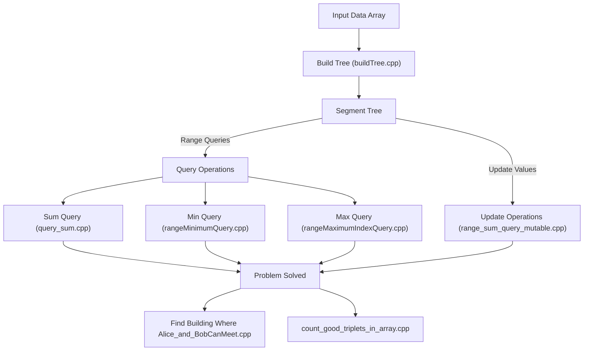

# 🚀 leetcode

## Short Description
Dive into the world of efficient algorithmic problem-solving with this curated collection of C++ solutions, meticulously crafted around the powerful Segment Tree data structure. This repository serves as an invaluable resource for competitive programmers, students, and developers aiming to master advanced data structures and optimize their solutions for a wide array of range query and update problems.

## ✨ Key Features
*   **Comprehensive Segment Tree Implementations:** Explore robust C++ code for building, querying (sum, min, max), and updating Segment Trees.
*   **Diverse Problem Set:** Solutions to classic and complex problems, including range minimum/maximum queries, mutable range sums, counting good triplets, and specific scenario-based problems.
*   **Optimized Performance:** Leverage highly efficient Segment Tree algorithms designed for optimal time complexity.
*   **Clear & Modular Code:** Each solution is presented in a standalone `.cpp` file, promoting easy understanding and reusability.
*   **Competitive Programming Ready:** Ideal for preparing for coding contests and technical interviews requiring a strong grasp of data structures.

## Who is this for?
*   **Competitive Programmers:** Looking for battle-tested Segment Tree implementations and problem solutions.
*   **Computer Science Students:** Seeking practical examples and hands-on understanding of advanced data structures.
*   **Interview Candidates:** Preparing for coding interviews where efficient algorithms are crucial.
*   **Algorithm Enthusiasts:** Anyone interested in the intricate details and powerful applications of Segment Trees.

## Technology Stack & Architecture
*   **Primary Language:** C++
*   **Core Data Structure:** Segment Tree
*   **Problem Domain:** Algorithmic Problem Solving, Competitive Programming
*   **Architecture:** A collection of independent C++ source files, each dedicated to solving a specific problem or demonstrating a key operation using the Segment Tree data structure. The project is organized to provide clear, single-purpose examples.

## 📊 Architecture & Database Schema
The core of this repository revolves around the versatile Segment Tree, facilitating various range operations efficiently. Below is a high-level conceptual flow of how the Segment Tree is typically utilized across the solutions.



## ⚡ Quick Start Guide
To get started with exploring these powerful Segment Tree solutions:

1.  **Clone the Repository:**
    ```bash
    git clone https://github.com/grewal16/leetcode.git
    cd leetcode/segmentTree
    ```
2.  **Compile a Solution:** Choose any `.cpp` file and compile it using a C++ compiler (like g++).
    ```bash
    g++ buildTree.cpp -o buildTree
    ```
3.  **Run the Executable:**
    ```bash
    ./buildTree
    ```
    Each `.cpp` file is designed to be a self-contained example. Feel free to modify, compile, and experiment with any of the provided solutions to deepen your understanding.
