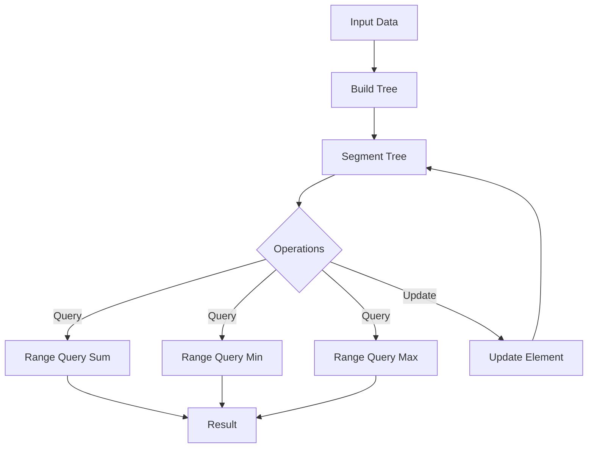

# 🚀 LeetCode Data Structures: Segment Tree Mastery

## Short Description
Dive into the world of efficient range queries and dynamic updates with this meticulously crafted collection of Segment Tree implementations. This repository provides optimized C++ solutions for classic LeetCode problems and fundamental Segment Tree operations, designed for competitive programmers, algorithm enthusiasts, and anyone looking to master advanced data structures. Unleash the power of logarithmic time complexity for your array-based challenges!

## ✨ Key Features
*   **Comprehensive Segment Tree Operations:** Full implementations for building, querying (sum, min, max), and updating Segment Trees.
*   **LeetCode Problem Solutions:** Tackle complex problems like "Find Building Where Alice and Bob Can Meet" and "Count Good Triplets" with elegant Segment Tree-based approaches.
*   **Optimized Range Queries:** Achieve blazing-fast `O(log n)` performance for range sum, minimum, and maximum queries.
*   **Dynamic Array Updates:** Efficiently handle point updates on mutable arrays while maintaining query performance.
*   **Battle-Tested C++:** Robust and idiomatic C++ code, ready for competitive programming environments and interviews.

## Who is this for?
*   **Competitive Programmers:** Level up your problem-solving arsenal for contests.
*   **Algorithm Enthusiasts:** Deepen your understanding of advanced data structures.
*   **Students & Learners:** Explore practical applications of Segment Trees.
*   **Interview Candidates:** Prepare for technical interviews by mastering common algorithmic patterns.

## Technology Stack & Architecture
This project is built primarily with **C++**, focusing on pure algorithmic implementations. The core "technology" is the **Segment Tree data structure** itself, demonstrating its versatility in solving a variety of array-based problems requiring efficient range queries and updates.

## 📊 Architecture & Database Schema
This repository focuses on algorithmic solutions, not a traditional database schema. Below is a conceptual flow diagram illustrating the core operations and architecture of a Segment Tree, which is the central component of this project.



## ⚡ Quick Start Guide
To get these powerful Segment Tree solutions running on your local machine, follow these simple steps:

1.  **Clone the repository:**
    ```bash
    git clone https://github.com/grewal16/leetcode.git
    cd leetcode/segmentTree
    ```
2.  **Compile a specific solution (e.g., `buildTree.cpp`):**
    ```bash
    g++ buildTree.cpp -o buildTree
    ```
3.  **Run the compiled executable:**
    ```bash
    ./buildTree
    ```
Each `.cpp` file within the `segmentTree` directory is a self-contained solution or implementation of a Segment Tree concept. Feel free to explore and experiment with them!
