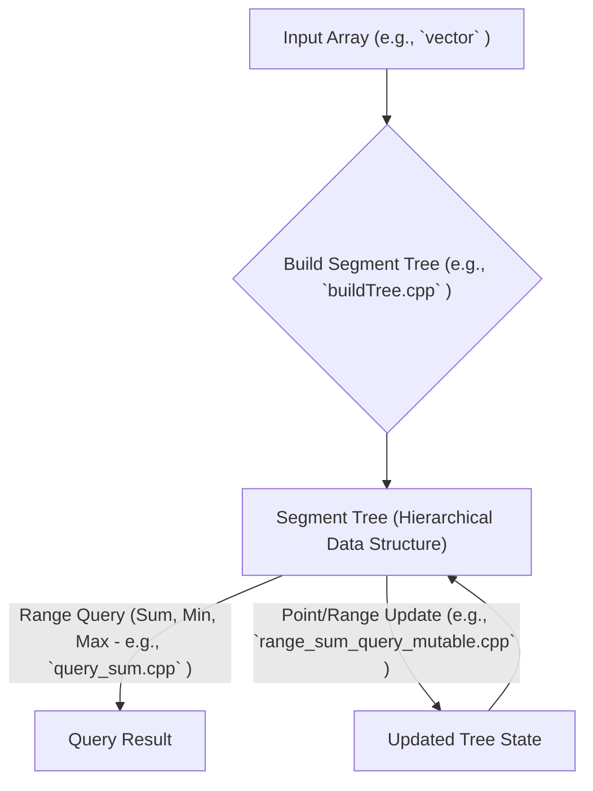

# 🚀 LeetCode Algorithms & Data Structures

## Short Description
Dive into a meticulously curated collection of advanced data structure implementations and algorithmic solutions, specifically tailored for competitive programming and technical interview preparation. This repository champions the power of Segment Trees, offering robust and optimized C++ solutions to complex range query and update problems that often stump even seasoned developers.

## 🛡️ Project Health & Status
This repository represents a rigorously developed and actively maintained set of algorithmic solutions. Each implementation is crafted for correctness and optimal performance, providing a highly reliable resource for understanding and applying advanced data structures in real-world problem-solving scenarios.

## ✨ Key Features
*   **Comprehensive Segment Tree Implementations:** Master the foundational `buildTree` operations and efficient `query_sum` functionalities.
*   **Advanced Range Queries:** Explore solutions for critical problems like `rangeMaximumIndexQuery`, `rangeMinimumQuery`, and `range_sum_query_mutable`.
*   **Problem-Specific Applications:** Discover practical Segment Tree uses with solutions for `FindBuildingWhereAlice_and_BobCanMeet` and `count_good_triplets_in_array`.
*   **Optimized C++ Codebase:** Benefit from clean, high-performance C++ code designed for competitive programming efficiency.
*   **Educational Resource:** A perfect learning companion for those looking to conquer complex algorithmic challenges.

## Who is this for?
This repository is an essential asset for:
*   **Competitive Programmers:** Gain an edge with highly optimized data structure implementations.
*   **Software Engineering Candidates:** Ace your technical interviews by mastering advanced algorithms and problem-solving techniques.
*   **Algorithm & Data Structure Enthusiasts:** Deepen your understanding of Segment Trees and their versatile applications.

## Technology Stack & Architecture
This project is built purely in **C++**, emphasizing raw algorithmic efficiency and direct data structure manipulation. It leverages the inherent speed and control offered by C++ to deliver high-performance solutions without external frameworks.

## 📊 Architecture & Database Schema
While this repository primarily focuses on individual algorithmic solutions rather than a holistic system architecture, the core operations around a Segment Tree can be visualized as a functional flow:



## ⚙️ Configuration & Deployment
The solutions within this repository are standalone C++ files. There is no complex configuration or deployment setup required. Simply having a standard C++ compiler (like g++) installed on your system is sufficient.

## ⚡ Quick Start Guide
To get started with any of the solutions:

1.  **Clone the Repository:**
    ```bash
    git clone https://github.com/grewal16/leetcode.git
    cd leetcode
    ```

2.  **Navigate to a Solution:**
    Choose any of the problems within the `segmentTree` directory.
    ```bash
    cd segmentTree
    ```

3.  **Compile and Run:**
    Using `g++` (or your preferred C++ compiler), compile the desired solution and then execute it.
    ```bash
    # Example: Compile
    g++ FindBuildingWhereAlice_and_BobCanMeet.cpp -o alice_bob_meet

    # Example: Run
    ./alice_bob_meet
    ```
    You may need to provide input as per the problem's requirements, typically through standard input.